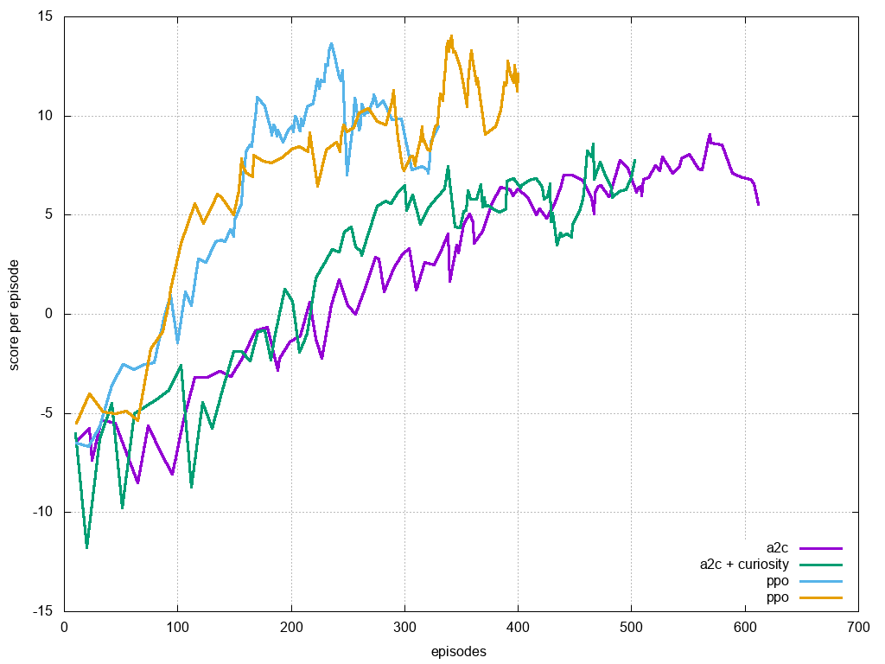
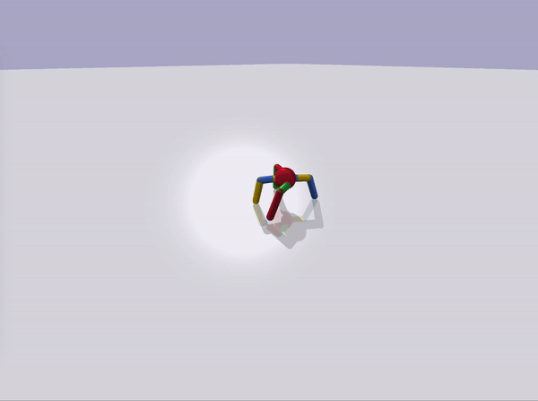
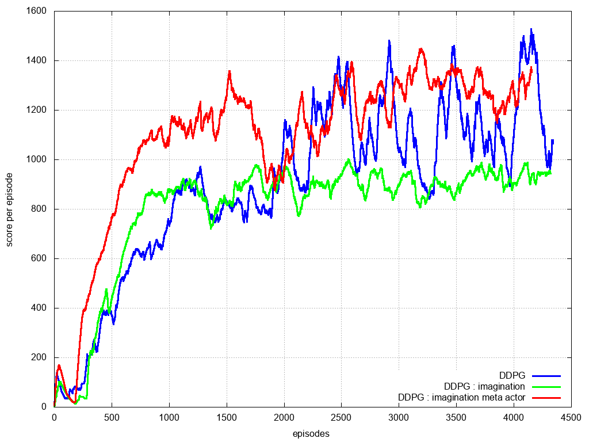
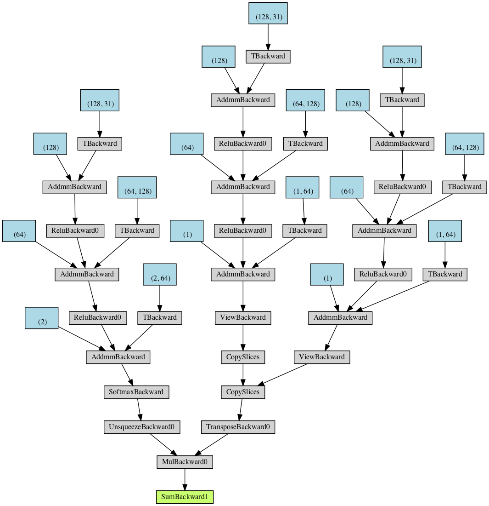

# curiosity_reinforcement_learning

some experiments with curiosity learning

# lunar lander results

# ANT  results

* DDPG : common ddpg
* DDPG + curiosity : simple environment forward model added
* DDPG + multihead curiosity : multiple environment forward models, controlled by attention mechanism

# multihead curiosity beast :

