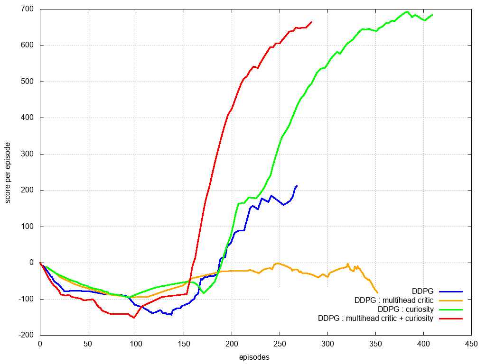

# curiosity_reinforcement_learning

some experiments with curiosity learning

playing with DQN and DDPG, with mutlihead critic or multihead curiosity module

# pybullet Ant walking

* DDPG : common ddpg
* DDPG multihead critic : two heads ddpg critic
* DDPG + curiosity : DDPG with bonus reward from environment forward model as curiosity module
* DDPG multihead + curiosity : two heads DDPG critic with bonus reward from environment multihead (2) forward model as curiosity module

# Line follower

* DDPG : common ddpg
* DDPG multihead critic : two heads ddpg critic
* DDPG + curiosity : DDPG with bonus reward from environment forward model as curiosity module
* DDPG multihead + curiosity : two heads DDPG critic with bonus reward from environment forward model as curiosity module

