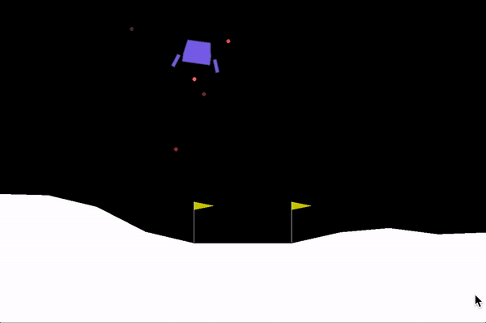

# curiosity_reinforcement_learning

some experiments with curiosity learning

# lunar lander results

* note : A2C was running in 8 paralel environments, total number of iterations (games) need to be multiplied by 8