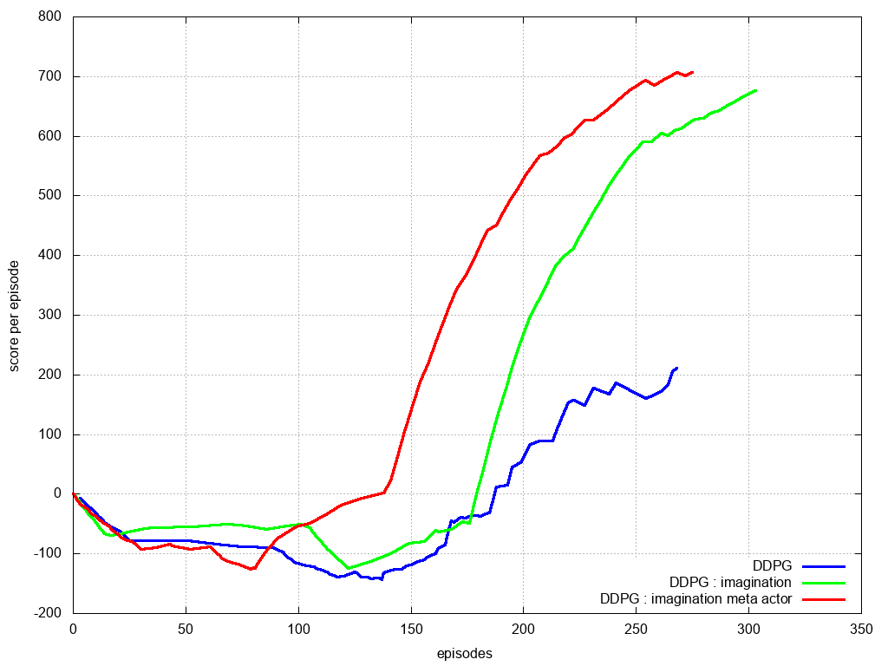

# curiosity_reinforcement_learning

some experiments with curiosity and imagination learning

playing with DQN and DDPG, with mutlihead critic or multihead curiosity module

# Line follower

* DDPG : common ddpg
* DDPG + imagination : DDPG imagination (4 rollouts + 4 steps) and bonus reward from imagination
* DDPG multihead + imagination : DDPG with multihead critic and imagination (4 rollouts + 4 steps) and bonus reward from imagination,

# pybullet Ant walking

* DDPG : common ddpg
* DDPG + imagination : DDPG imagination (4 rollouts + 4 steps) and bonus reward from imagination
* DDPG multihead + imagination : DDPG with multihead critic and imagination (4 rollouts + 4 steps) and bonus reward from imagination,
